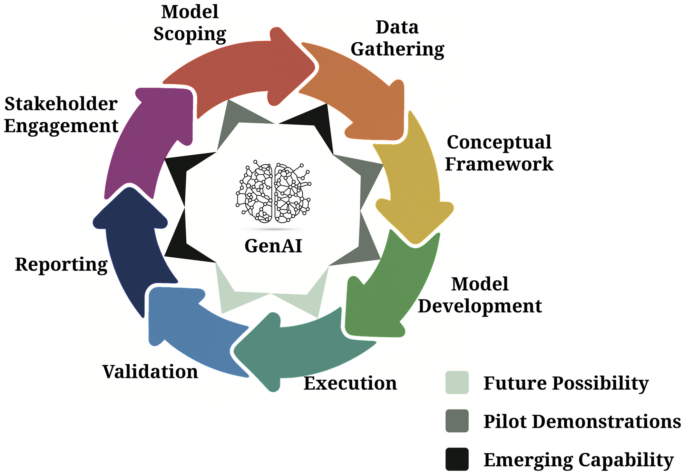

Welcome to this starter site for **Best practices for responsible AI applied to Marine Ecosystem Models (MEMs)**.

## Purpose

Outline how responsible AI principles can support trustworthy Marine Ecosystem Model development and use.

## What is Generative Artificial Intelligence (Generative AI)?

Generative AI are probabilistic models that generate outputs based on the statistical patterns they have been trained on, with some degree of randomness built in. 

## What are Large Language Models?

LLMs are predictive models trained on massive datasets of text, giving them a broad understanding of the world and how language is used. They are NOT knowledge repositories or databases.
The probabilistic nature of generative AI means that the same input can produce different outputs each time, which is a challenge for open and reproducible science.

## What is Responsible Generative AI?

Artificial Intelligence (AI) systems that adhere to the principles of:
- Fairness
- Accountability
- Transparency
- Inclusivity
- Reproducibility

Bano, M., Zowghi, D., Shea, P. and Ibarra, G., 2023. Investigating responsible AI for scientific research: an empirical study. arXiv preprint arXiv:2312.09561.

## How can Generative AI advance Marine Ecosystem Modeling (MEM)?

- Expedite modeling workflows and supplement the technical expertise needed so that MEM becomes more readily accessible end users.

Spillias 2026 summarises and exemplifies the potential contributions of GenAI to the modleing cycle (Figure 1): model scoping, data gathering, conceptual framework development, model development, model execution, validation and calibration, reporting, and stakeholder engagement, exploring how GenAI might improve efficiency and quality at each step. 

Spillias, S., 2026. A prospectus on generative artificial intelligence in marine ecosystem modelling. Fish and Fisheries, 27(2), pp.130-144.

## This repository provides an introduction to LLM capabilites with MEM examples with a focus on Responsible AI, as a first step in understanding how Gen AI can accelerate the MEM modeling cycle.

### We describe foundational principles and best practices for reproducible, robust applications of GenAI.

#### Please refer to the following references for more advanced applications of Gen AI in MEM

Spillias, S., 2026. A prospectus on generative artificial intelligence in marine ecosystem modelling. Fish and Fisheries, 27(2), pp.130-144.

Spillias, S. 2025. Benchmarking Large Language Models for Marine Functional Group Classification. Available at SSRN 5506941.

Spillias, S., E. A. Fulton, F. Boschetti, C. Bulman, J. Strzelecki, and R. Trebilco. 2025. Automated Diet Matrix Construction for Marine Ecosystem Models Using Generative AI. bioRxiv 2025 05.

Spillias, S., K. Ollerhead, M. Andreotta, et al. 2025. Evaluating Generative AI for Qualitative Data Extraction in Community-Based Fisheries Management Literature. Environmental Evidence 14, no. 1: 9.

## See the CONTRIBUTING.md file if you are interested in contributing to this repository