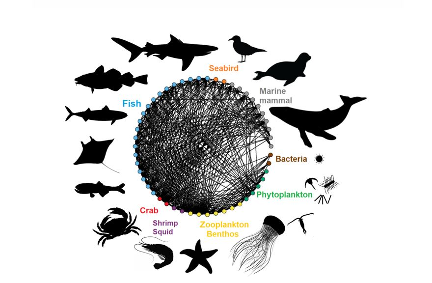

#Tutorial: Food web diagram

We will use an AI coding agent to generate a food web network diagram.


 

## Setup
This tutorial uses an Anthropic's Claude Code paid account and an API key. You can also get an API key for Gemini 2.5 Flash model free tier (Go to https://aistudio.google.com/ and log in with a Google account) and use it with Claude code following the instructions [here](https://www.lineserve.net/tutorials/how-to-run-claude-code-with-gemini-openai-or-anthropic-models).

### Prompting 
1. We will start by providing prompts to the AI coding agent 
#### What is prompting? Prompting is giving the AI coding agent context and instructions so that its response aligns with your goals, it usually combines the following elements:

- Task description: Clearly state the goal
- Context: Providing relevant background information or data
- Role: Specify what role or persona you want the AI to take on
- Requirements: List the style, format, or content requirements
- Boundaries: Setting limitations on what to exclude or avoid
- Reasoning: Asking the AI to explain its reasoning or approach

2.  To prevent repetitive prompting and increase reproducibility, we will generate and AGENT.md file.

## What is an AGENT.md file?

A plain Markdown file that provides instructions, context, and coding rules directly to the AI coding agent. The AGENT.md file automatically injects system-level context at the start of an AI session to help reduce AI hallucinations, eliminate the need for repetitive prompting, and ensure the AI writes code correctly on the first try. It also ensures the AI coding agent uses the correct data pipelines, respects data privacy laws (like PII), and runs testing frameworks properly.

# AGENTS.md - Example file

See [AGENTS.md](AGENTS.md) for instructions to configure your AI coding agent.
```{bash}
ln -s AGENTS.md CLAUDE.md

```

LLMs 
AI agents are software systems that use AI to pursue goals and complete tasks on behalf of users. They show reasoning, planning, and memory and have a level of autonomy to make decisions, learn, and adapt.

Their capabilities are made possible in large part by the multimodal capacity of generative AI and AI foundation models. AI agents can process multimodal information like text, voice, video, audio, code, and more simultaneously; can converse, reason, learn, and make decisions. 

We now create the folder structure for skills.


```{bash}
list-species-by-region
```

